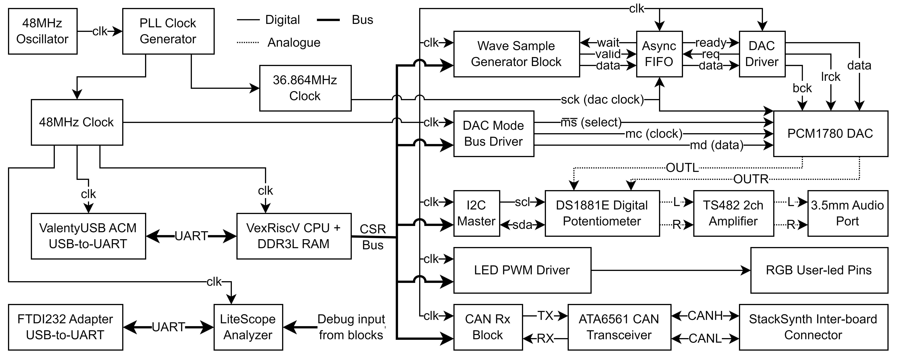

Write-up of `FPGA Accelerator for StackSynth`

> Write up everything that you are in a position to, where feedback is likely to be helpful. Lay out the headings and the general content of each section.

**What changes need to be made?**

# Title Page

Standard Template is on Intranet

- Project Title: FPGA Accelerator for StackSynth
- Student: Aadi Desai
- CID: 01737164
- Course: EIE4
- Project Supervisor: Dr Ed Stott
- Second Marker: Dr T.J.W Clarke

# Acknowledgements

I would like to thank Dr Ed Stott for his time and patience in the many meetings it took to discuss this project, as well as his guidance in architectural decisions that impacted the entire project. Without this insight, this project may not have been completed to a standard useful for future students.

TODO: Do this at the end

# Abstract

TODO: Summarise better

The StackSynth module is an educational synthesiser platform based on the STM32L432, an ARM Cortex-M4 based CPU, which is well suited for the low-level realtime programming learning objective of the Embedded Systems module. However, it is not optimised for the Digital Signal Processing operations needed for complex audio waveform generation.

This project develops an FPGA-based extension module for StackSynth, with the purpose of increasing the audio ability and performance of the synthesiser, while offering future Embedded Systems students an opportunity to develop code for a RISC-V System-on-Chip. The main contribution of this project is the SystemVerilog modules and LiteX wrappers for receiving low-speed CAN frames, producing waveforms for a given frequency, converting from phase to a sine wave and driving the PCM1780 DAC audio / control ports. In addition, there are demo C++ programs and helper functions for interfacing with the custom logic and finally, integration of these custom logic blocks into a LiteX project that facilitates the use of the existing IP for the CPU, memory controller, USB controller and interfaces.

The API for controlling the custom SystemVerilog logic has been designed to be simple to implement within student-written FreeRTOS tasks, similar to the existing Embedded Systems Module coursework C++ architecture.

# Contents

- [Title Page](#title-page)
- [Acknowledgements](#acknowledgements)
- [Abstract](#abstract)
- [Contents](#contents)
- [List of Figures](#list-of-figures)
- [List of Tables](#list-of-tables)
- [List of Abbreviations](#list-of-abbreviations)
- [Introduction](#introduction)
- [Background](#background)
  - [Requirements Capture](#requirements-capture)
  - [StackSynth Board](#stacksynth-board)
  - [StackSynth FPGA Extension Board](#stacksynth-fpga-extension-board)
  - [OrangeCrab Board](#orangecrab-board)
  - [LiteX Framework](#litex-framework)
  - [PCM1780 DAC](#pcm1780-dac)
  - [CAN Bus](#can-bus)
  - [ATA6561 CAN Transceiver](#ata6561-can-transceiver)
- [Analysis and Design](#analysis-and-design)
- [Implementation](#implementation)
  - [Setting up the LiteX Framework](#setting-up-the-litex-framework)
  - [Generating Audio Samples](#generating-audio-samples)
    - [Sine Wave Approximation](#sine-wave-approximation)
  - [Transferring samples across clock domains](#transferring-samples-across-clock-domains)
  - [Driving the DAC (PCM1780)](#driving-the-dac-pcm1780)
  - [Using LiteScope Analyzer](#using-litescope-analyzer)
  - [Receiving CAN Frames](#receiving-can-frames)
  - [Controlling the design from software](#controlling-the-design-from-software)
  - [Interrupts and Scheduling](#interrupts-and-scheduling)
  - [FPGA Utilisation](#fpga-utilisation)
- [Testing and Results](#testing-and-results)
  - [Phase to sine amplitude conversion](#phase-to-sine-amplitude-conversion)
  - [CORDIC propagation delay](#cordic-propagation-delay)
  - [Receiving and acknowledging CAN frames](#receiving-and-acknowledging-can-frames)
  - [Software-interrupt detection of CAN frames](#software-interrupt-detection-of-can-frames)
  - [Integration with StackSynth board](#integration-with-stacksynth-board)
- [Evaluation](#evaluation)
- [Conclusions and Further Work](#conclusions-and-further-work)
- [User Guide](#user-guide)
  - [Prerequisites](#prerequisites)
  - [Running the Project](#running-the-project)
- [Bibliography](#bibliography)
- [Appendix](#appendix)

# List of Figures

# List of Tables

# List of Abbreviations

- ACM: Abstract Control Model (USB Class)
- AXI: Advanced eXtensible Interface
- BRAM: Block RAM
- CAN: Controller Area Network
- CDC: Communications Device Class (USB Class)
- CPU: Central Processing Unit
- CSR: Control and Status Register
- DAC: Digital-to-Analogue Converter
- DFU: Device Firmware Upgrade (USB Class)
- DSL: Domain Specific Language
- DUT: Device Under Test
- FIFO: First-In First-Out
- FPGA: Field-Programmable Gate Array
- GPIO: General Purpose Input/Output
- HDL: Hardware Description Language
- IRQ: Interrupt ReQuest
- ISR: Interrupt Service Routine
- LUT: Look-Up Table
- MOSFET: Metal-Oxide Semiconductor Field-Effect Transistor
- MSB: Most Significant Bit
- PLL: Phase-Locked Loop
- PWM: Pulse-Width Modulation
- QSPI: Quad Serial Peripheral Interface
- RAM: Random Access Memory
- ROM: Read-Only Memory
- RTL: Register-Transfer Level
- SoC: System-on-Chip
- TTY: TeleTYpe (USB Class)
- VCD: Value Change Dump

# Introduction

- TODO: Summarise the rest of the report, focus on rationale, aims, terms of reference, brief mention of what is to come/in each chapter, ie does it work or not

> High level problem statement / motivation. Outline the main problems your project addresses, and introduce the structure of the remaining report, what is covered in which chapters and how they relate to each other, but not in detail.

# Background

This section goes over the research and existing work that this project builds upon, as well as key aspects of the project that inform the analysis and design stages. The sub-sections focus on the StackSynth module, OrangeCrab board, LiteX framework, PCM1780 DAC, CAN bus and ATA6561 transceiver.

## Requirements Capture

The aim of this project is to extend the existing StackSynth platform that is used in the 3rd Year Embedded Systems ([ELEC60013](https://intranet.ee.ic.ac.uk/electricalengineering/eecourses_t4/course_content.asp?c=ELEC60013&s=D4)) with an FPGA accelerator to increase the audio performance and capabilities of the StackSynth educational platform. The key motivators are to allow for many more oscillators than is possible on the ST Nucleo L432KC as well as advanced effects such as equalisation with multiple filter taps, as the available time for generating samples on the L432KC is limited due to strict deadlines for sample timing to prevent audible glitches.

The original brief mentions that using an FPGA would allow for "hundreds" of simultaneous oscillators and filter taps, however the maximum number of oscillators and filter taps is likely to be limited by the available logic on the FPGA fabric, as the selected model of FPGA has 24,000 LUTs (look-up tables) to create logic blocks from. This is discussed later in the [FPGA Utilisation](#fpga-utilisation) section. The brief also states that "a professional-grade sample rate and resolution" should be achievable, so the industry standard for "CD-quality" is used as a baseline giving a target of 16-bit 44.1kHz output, as higher bit depth and sampling rate is often not perceived.

As the end goal is to have an educational aid, there are some quantitative targets for usability. Using the FPGA accelerator should be an extension of the existing coursework, with difficulty caused by intentional complexity of the project, not from implementation details that cannot be changed by the student. The syllabus for the embedded systems module [ELEC60013] states learning objective including: low-level communication, real-time constraint analysis, interrupts and multi-threading. The FPGA extension will allow students to program an embedded SoC and develop code to communicate with the main StackSynth boards, using interrupt service routines and handlers.

The embedded SoC will run student developed code which handles various tasks including: communication with other StackSynth modules via the CAN bus, controlling the oscillators and filter taps and processing of slower loops such as low-frequency oscillators and other effects over longer periods of time. The digital logic blocks to be developed in this project are the CAN receiver, sample generator and blocks to drive the various buses to control the onboard DAC and amplifier.

The core contributions of this project are the following:

- Quarter-wave sine wave approximation CORDIC SystemVerilog module and multi-wave generator LiteX module
- PCM1780 Audio driver and Mode Control SystemVerilog and LiteX modules
- CAN receiver SystemVerilog and LiteX module, used to receive and acknowledge CAN frames from StackSynth boards
- LiteX project including hardware interrupts, which can be used as a base for further development
- Demo code including programs and helper functions for interacting with custom modules from software

## StackSynth Board

The StackSynth board is part of an educational platform designed to teach real-time programming in the situation of a music synthesiser, and is part of the 3rd Year Embedded Systems [ELEC60013] module. It utilises the PlatformIO framework which provides the HAL (Hardware Abstraction Layer) and a port of the Arduino Framework (Stm32duino) which allows for easier control of external pins of the microcontroller.

A music synthesizer is a good demonstration of real-time programming and prioritisation of work, as latency in an audio stream is less important than interval consistency of audio samples, resulting in strict deadlines for sample generation. The StackSynth board uses a Nucleo [STM32L432KC](https://www.st.com/en/microcontrollers-microprocessors/stm32l432kc.html) board ([datasheet](https://www.st.com/resource/en/datasheet/stm32l432kc.pdf)), which has an ARM Cortex-M4 core, as well as 11 timers with varying precision and uses, and direct support for the CAN protocol in the provided HAL as detailed in section 3.29 of the [datasheet]. The timers are especially helpful for setting task interval initiation interrupts, pre-empting lower priority tasks so that deadlines are not missed.

The ARM Cortex-M4 core has support for some DSP (digital signal processing) instructions, as defined in [Table 3-2, ARM Cortex-M4 DSP Instructions](https://developer.arm.com/documentation/100166/0001/Programmers-Model/Instruction-set-summary/Table-of-processor-DSP-instructions), however these are not optimised for operating on many samples in parallel or for the complex DSP operations of an equaliser filter tap. FPGA logic operates simultaneously each clock cycle, so can operate on every sample at once in a pipeline reducing the latency of audio effects.

Communication on the CAN bus will still be done on the StackSynth module, including `notedown` and `noteup` events, defined by sending `P` or `R` in byte 0 of the CAN frame respectively, in addition to student-defined messages such as waveform and filter settings if controlled from a StackSynth module.

## StackSynth FPGA Extension Board

Audio sample generation is subsequently handled on the FPGA extension board where students will decode their CAN messages on the embedded SoC and then control the oscillators and filters. The extension board has headers for attaching the OrangeCrab FPGA module and a few chips along with passive components for tasks not handled within the FPGA.

A Microchip ATA6561 CAN Transceiver along with connectors along the sides of the board allow for detection of and communication with other StackSynth modules via the CAN bus. The transceiver handles conversion from high and low logic states to recessive and dominant states on the CANH and CANL pins, and is discussed in more detail in a [later section](#ata6561-can-transceiver).

A Texas Instruments PCM1780 DAC is connected to the FPGA GPIO pins, with the output connected to one 3.5mm headphone port and the input of an Analog Devices DS1881E-050+ [(datasheet)](https://www.analog.com/media/en/technical-documentation/data-sheets/DS1881.pdf) digital potentiometer which is used to adjust the amplitude of the analogue waveform providing volume control. This waveform is the input to a TS482IST [(datasheet)](https://www.st.com/resource/en/datasheet/ts482.pdf) 100mW stereo amplifier which provides enough amplification and power to drive low impedance speakers and headphones via a second 3.5mm headphone port.

## OrangeCrab Board

The [OrangeCrab](https://orangecrab-fpga.github.io/orangecrab-hardware/r0.2/) is a development board built around the LFE5U-25F and LFE5U-85F, which are part of the Lattice Semiconductor ECP5 family of FPGAs. For this project, the LFE5U-25F model of the OrangeCrab was used due to limited availability and increased cost of the larger FPGA model. The specifications of the LFE5U-25F are as follows: 24,000 LUTs, 1008Kb of embedded Block RAM, 194kb of distributed RAM, 28 18-bit multipliers and 2 PLLs. The OrangeCrab also includes 128Mb of non-volatile QSPI flash used for storing the bootloader/bitstreams/user-firmware, a MicroSD card slot and a 48MHz oscillator used as a source for the system-clock PLL.

The OrangeCrab follows the [Adafruit Feather](https://cdn-learn.adafruit.com/downloads/pdf/adafruit-feather.pdf) form factor, making it physically compatible with FeatherWings which are stackable expansion boards for Feather boards. This means the OrangeCrab could be swapped out for a more powerful board using the same pin layout if required in the future. Various FPGA pins are routed to the external pins of the board, allowing for direct connections from a design to external devices, which will be used in this project to communicate with the ATA6561 CAN Transceiver, PCM1780 DAC and TS482IST digital potentiometer.

The OrangeCrab hardware is released as open-source under the CERN Open Hardware Licence v1.2, along with firmware released under the MIT Licence in the [GitHub Repository](https://github.com/orangecrab-fpga/orangecrab-hardware). Bitstreams for flashing the FPGA can be created with either Lattice Semiconductor's Diamond IDE or the open-source [Project Trellis](https://github.com/YosysHQ/prjtrellis) toolchain which uses Yosys for synthesis and nextpnr for placement and routing. Gateware and software examples are also provided in another [GitHub Repository](https://github.com/orangecrab-fpga/orangecrab-examples).

The r0.2.1 board also features a USB-C port connected directly to pins on the FPGA, allowing a design to present itself to USB hosts as a DFU (Device Firmware Upgrade), TTY (Teletype), CDC (Communications Device Class), ACM (Abstract Control Model) or even a composite USB device. Along with the pre-flashed bootloader, which presents a DFU endpoint, the OrangeCrab can be flashed without an external programmer.

The USB port operates at USB 2.0 Full Speed (12Mbps) as higher speeds are not possible on the ECP5. It can be used in user designs by instantiating a USB core, and the demo program uses [ValentyUSB](https://github.com/im-tomu/valentyusb), enumerating as a CDC-ACM device, which results in a `COM` port on Windows and `/dev/ttyACMx` on Linux.

## LiteX Framework

LiteX is a framework for creating FPGA cores and complex SoCs, using many provided cores such as CPUs, DRAM interfaces and protocol buses, eg Wishbone, AXI, Avalon. LiteX is used in this project as it provides many useful cores and makes connecting different blocks together easier, reducing the time taken for this project to reach a working Proof of Concept.

LiteX has support for a large range of boards, and the creator of the OrangeCrab added support in [litex-hub/litex-boards, PR #59](https://github.com/litex-hub/litex-boards/pull/59), including the necessary pin definitions and [Project Trellis](https://github.com/YosysHQ/prjtrellis) toolchain steps for creating the bitstream for the OrangeCrab r0.2(.1) used in this project with Yosys and nextpnr targetting the Lattice Semiconductor ECP5.

The LiteX project initially built upon [Migen](https://github.com/m-labs/migen), so many of the Migen cores are still available and the overall method of defining modules, synchronous and combinatorial logic remains in line with Migen. Migen - and by extension LiteX - is a DSL (Domain Specific Language) using Python and the dictionary nature of all variables to provide terse syntax for defining logic. This syntax is shown in Listing x.y [below].

[Listing: Diagram of defining `comb` and `sync` logic in LiteX]

After defining logic and instantiating blocks within a design, the provided `Builder()` function iterates through the map of the defined `BaseSoC` object and converts the design to a Verilog file representing the full design. The resulting Verilog file has ports for connections to external pins, defined in the Pin Constraints File, and is synthesised using Yosys, along with any SystemVerilog and Verilog files instantiated within the design using the `Instance()` function. An example of this is shown in Listing x.y [below].

[Listing: Example of `Instance()` function]

The key components of LiteX used in this project are:

- `GSD_OrangeCrab.Platform`: defines connections from external FPGA pins to peripherals, eg. the QSPI flash, DDR3L RAM and board GPIO, as well as required blocks such as clock sources, PLLs, the CPU and the USB PHY for serial communication
- `ClockDomain`: creates a new clock domain, used for the DAC system clock, driven at 36.864MHz as indicated in the PCM1780 datasheet for a 48kHz sample rate
- `Subsignal`: defines collections of signals for easier pin assignment within modules
- `LiteScopeAnalyzer`: a logic analyser placed alongside the SoC, sampling any selected signals within the design at the system clock frequency, with values stored in Block RAM and converted a VCD waveform file which can be viewed in GTKWave
- `Builder`: converts the design object to a Verilog and invokes Yosys and nextpnr to synthesize and generate the FPGA bitstream
- `Module`: creates a custom module that can be instanced and added as a submodule to other modules or the `BaseSoC`
- `ModuleDoc`: inheriting from this class results in the class docstring being used in the autogenerated documentation, allowing the documentation of a module to be placed alongside the module definition
- `CSRStorage`: register object that is read/write from the CPU and read-only from custom logic
- `CSRStatus`: register object that is read-only from the CPU and driven from custom logic
- `AutoCSR`: inheriting from this class adds all detected `CSRStorage` and `CSRStatus` blocks within a module to the CSR bus, providing preprocessor definitions for register addresses as well as functions to read/write to the registers or individual fields within the registers
- `Instance`: creates an instance of an external Verilog or SystemVerilog module, including connections from the module ports to the LiteX design
- `AsyncFIFO`: core from the Migen library with read and write ports that can be located in different clock domains. Grey code is used to prevent metastability issues in the full and empty flags. It is used to transfer generated samples from the system clock domain at 48MHz to the DAC clock domain at 36.864MHz

## PCM1780 DAC

The [PCM1780](https://www.ti.com/product/PCM1780) is a 2 channel DAC supporting 16-24bit samples at a 8-192kHz sampling frequency. Audio samples can be input via I2S, right-justified or left-justified formats, and separate buses are used for transferring audio samples or controlling the mode settings of the DAC. The PCM1780 is used in this project to provide superior audio quality than other methods of outputting audio from the FPGA, such as PWM (Pulse Width Modulation).

The PCM1780 settings are controlled via a 3-wire SPI-like interface, with a chip-select, clock and data-in pin. No data is ever read from the DAC so the data-out pin is not present. The available settings are shown in Table x.y [below], taken from [Table 5. User-Programmable Mode Controls] of the [datasheet](https://www.ti.com/lit/gpn/pcm1780) or [direct pdf](https://www.ti.com/lit/ds/symlink/pcm1780.pdf).

[Table: PCM1780 settings]

The default settings for the PCM1780 are ideal for this project, though the digital attenuation may be used as another point of volume control, possibly to normalise the output volume regardless of the number of oscillators that are active. As such the only settings that need to be modified are the attenuation level for the left and right channels.

The default settings also include the audio sample format of left-justified, which allows for flexibility of the sample depth as a 16-bit sample is equivalent to a 24-bit sample where the low 8 bits are 0. This is shown in Figure x.y [below], taken from [Figure 22. Audio Data Input Formats] of the datasheet. To give this output, a shift register can be used to output the sample bit by bit, updated on the falling edge of the bit clock as shown in Figure x.y [below]. The bit clock can run at 32x, 48x or 64x the sampling frequency and can be selected for easier implementation within the SystemVerilog design, though the bit depth is limited by lower bit clock frequencies.

[Figure: PCM1780 audio data input formats]

The timing diagram of the control interface is shown in Figure x.y [below], taken from [Figure 26. Control Interface Timing] of the datasheet. In the figure, `MC pulse cycle time` limits the maximum frequency of the clock signal, and the value of 100ns results in a maximum frequency of 10MHz. As the OrangeCrab has a 48MHz system clock, a 6MHz clock signal can be generated using a 1:8 clock divider, simplifying the design and reducing delay / clock skew. The timing diagram also shows setup and hold time requirements for the data signal.

[Figure: PCM1780 control interface timing diagram]

The data to be sent will be crossing from a 48MHz clock domain into a 6MHz clock domain, but as the latter is derived from the former using logic, there is no risk of a change in phase and metastability can be avoided by holding the value stable in the faster domain for multiple clock cycles and buffering the value in the slower domain. In this design, the value can be left constant until a new value is set as the action of setting the attenuation value is idempotent and does not have a side-effect from being repeated.

## CAN Bus

The CAN (Controller Area Network) bus is a differential serial bus used for communication between devices, typically in automotive applications due to its ability to withstand electromagnetic interference and wiring simplicity requiring only a twisted pair of wires common to all devices on the bus. The [Wikipedia page](https://en.wikipedia.org/wiki/CAN_bus) for the CAN bus provides an overview including key features of the protocol, however for timing and implementation specifics, the [Bosch CAN Specification 2.0](http://esd.cs.ucr.edu/webres/can20.pdf) and [Texas Instruments: Introduction to CAN](https://www.ti.com/lit/an/sloa101b/sloa101b.pdf) documents were used as reference material.

The CAN bus is a multi-master bus, so any device can transmit at any time. In order to prevent collisions and loss of data, a form of arbitration is used to select which device has priority. This is done by assigning each message a unique ID, and the device with the lowest ID wins arbitration. This is inherent to the design of the CAN bus as transmitting a 0 is done by asserting the dominant state on the CANH and CANL signals and each device measures the state of the bus to determine if it should stop transmitting, so a device transmitting a recessive state will still be able to detect the dominant state. This is shown in Figure x.y [below], where device 0 has a lower ID than device 1 and so device 1 stops transmitting when it detects the dominant state on the bus.

[Figure: CAN bus arbitration]

In this project, low-speed CAN is used as the data to be transferred between devices is a few bytes at a time, and limited by the student code on each StackSynth module. In addition, the length of the CAN bus is determined by how many StackSynth devices are chained together, resulting in ~15cm per module so electromagnetic interference is unlikely to be an issue. On the StackSynth FPGA Extension board, the CAN bus signalling is handled by a Microchip ATA6561 Transceiver, as detailed in the [following section](#ata6561-can-transceiver).

Two key features of low-speed CAN are: a bit rate of 125k baud, resulting in ~8us per bit for propagation and sampling across the bus or 384 cycles at the 48MHz system clock of the OrangeCrab; and differential signalling, where the exact voltage levels of CANH and CANL are not important, but the polarity of the difference between the two signals (CANH - CANL) is used to determine the state of the bus, further reducing the impact of electromagnetic interference.

An important requirement of all CAN variants is that each frame must be acknowledged by at least one other device on the bus, otherwise the transmitting device may choose to retransmit the frame indefinitely or enter an error state. In the case of the StackSynth module, this results in the user-program CAN transmit queue being full, and the program blocking when attempting to add a new transmit message to the queue. The ATA6561 Transceiver does not contain any logic for automatically acknowledging frames, so the ACK signal must be generated within the FPGA logic. This is done by checking the ID of the received frame against a CAN receive ID filter after masking with a filter ID mask, and then driving the bus to a dominant state during the ACK bit of the frame if the frame is valid. This is shown in Figure x.y [below], taken from [Figure 7. CAN Frame Format] of the Bosch CAN Specification 2.0 document.

[Figure: CAN frame format showing ACK bit highlighted]

The CAN Specification also indicates that the bus should be sampled at 75% of the "bit time", or 6us into a bit for a 8us period in low-speed CAN. This precise timing is maintained by synchronising every device on the CAN bus with each incoming recessive to dominant transmission. This occurs at the start of each frame as well as throughout the frame, at least as often as every 10 bits due to the presence of stuffed bits, preventing a build-up of clock skew and errors in sampled bits.

The CAN protocol is a NRZ (Non Return-to-Zero) protocol, meaning consecutive bits of the same polarity result in no change in the bus state. If many consecutive bits of the same polarity were transmitted, this could result in devices losing synchronisation with each other if there were differences in internal clock frequencies and timing. To prevent this, bit stuffing is used, where extra bits of opposing polarity are added after a sequence of consecutive bits of the same polarity, with stuffed bits counting towards the sequence of consecutive bits. In CAN, a stuffed bit is added after 5 consecutive bits of the same polarity, so a stuffed bit can occur after every 4 non-stuffed bits. This is shown in Listing x.y [below], where a sequence of 10 bits is stuffed to a length of 12 bits, with the 6th and 11th bits being stuffed bits. An error occurs on the CAN bus if 6 consecutive bits of the same polarity are detected, with the exception of the End-Of-Frame marker which has no stuffed bits and is always 7 consecutive 1s.

[Listing: Bit stuffing example] 0000011110 -> 00000**1**1111**0**0

A complete CAN bus frame is shown [below] in Figure x.y, where the frame ID is xxx, and the frame contains xxx bytes of data. In the case of the StackSynth module, the data length is hardcoded to 8 bytes within the CAN helper library, with unused bytes being ignored by the receiving device.

[Figure: CAN frame format]

In addition to the frame ID, data length and data bytes, the CAN frame also contains a CRC (Cyclic Redundancy Check) field which allows for detection of errors in the received frame. This is calculated using the generator polynomial $x^15+x^14+x^10+x^8+x^7+x^4+x^3+1$ as prescribed in the [Bosch CAN Specification 2.0](http://esd.cs.ucr.edu/webres/can20.pdf) with the input sequence of the Start-Of-Frame, Frame ID, Control Field (ID extension bit, reserved bit and data length code) and Data Field. As described in the CAN specification, this can be implemented using a shift register with an XOR with `0x4599` when the next incoming bit is high. The CRC is then transmitted in the CRC field of the CAN frame, and the receiving device can calculate the CRC of the received frame and compare it to the received CRC to determine if the frame is valid. If the CRC is not valid, the frame is discarded and the receiving device does not acknowledge the frame.

## ATA6561 CAN Transceiver

The Microchip [ATA6561](https://www.microchip.com/en-us/product/ATA6561) ([datasheet](https://ww1.microchip.com/downloads/aemDocuments/documents/OTH/ProductDocuments/DataSheets/20005991B.pdf)) is a CAN and CAN-FD capable Transceiver chip that provides a physical interface from a CAN protocol controller to the CANH and CANL pins as well as protection against ESD and other faults on the CAN bus such as electrical short-circuits that could occur when (dis-)connecting StackSynth modules. It is used to convert CAN protocol bits from the FPGA to differential signals required on the CAN bus, and includes support for 3.3/5V tolerant inputs and outputs, allowing direct connections to microcontroller or FPGA external pins without level shifting. This direct connection is possible due to the `STBY` and `TXD` inputs being connected to the `VIO` pin via internal pull-up resistors and the `RXD` output being driven from `VIO` via a pair of MOSFETs as shown in Figure x.y [below], taken the Functional Block Diagram on page 3 of the ATA6561 [datasheet].

[Figure: ATA6561 Functional Block Diagram]

The ATA6561 also provides protection to the CAN bus from the CAN controller in two key situations. First, if the `RXD` pin is driven high externally, such as an accidental logic-high output from the FPGA or a short-circuit to VCC, this represents a recessive state and would prevent a CAN controller from detecting a dominant state on the CAN bus, causing arbitration to fail. Second, if the `TXD` pin is driven low for longer than the `TXD dominant timeout`, the CANH and CANL pins are disconnected (high-impedance) as driving a constant dominant state on the CAN bus would block all other network communication. This timeout is reset when the `TXD` pin is driven to logic-high.

The transceiver has 4 operating modes, however only `Normal` mode is used, as this allows for monitoring of the CAN bus via the RXD pin, and driving the CAN bus to the dominant state when TXD is driven low, such as for acknowledging a received frame. The other modes are `Unpowered`, `Standby` and `Silent`, which are either not useful in operation, or in the case of `Silent`, is not accessible on the ATA6561 by the user, and only occurs when an error is detected on the CAN bus. Finally, the ATA6561 is a clockless and combinatorial device, and can be treated as a direct connection from the FPGA to the CAN bus. The FPGA logic keeps track of bit timing, and drives the `TXD` pin as needed.

# Analysis and Design

> Examiners are just as interested in the process as the end result, include design decisions, the available options and reasons for particular choices (critical assessment). Explain trade-offs including those out of your control.

This section presents a high-level overview of the design of the system, and details design decisions that apply to the system as a whole rather than a specific area of implementation. Changes that were made to the design during implementation are discussed in the [implementation](#implementation) section.

Figure x.y [below] is a block diagram representation of the StackSynth FPGA Extension board including SoC and external Integrated Circuit components that are integral to the project function. Dotted lines represent analogue signals, which includes the stereo audio signals from the PCM1780 DAC, through the DS1881E digital potentiometer and through the TS482 amplifier and 3.5mm headphone port. Thinner solid lines are single bit digital signals, including clock signals and serial bit connections, while thicker solid lines are multi-bit digital signals or buses, including UART and the CSR bus. Later in the project, the VexRiscV CPU was replaced with a PicoRV32 CPU for testing a basic software implementation of interrupts, however the overall architecture of the system remained unchanged.


> Figure: System Overview (Sideways to fill a page)

In Figure x.y, the `Wave Sample Generator Block` represents a conversion from settings controlled from the CPU via the CSR bus to the final output samples sent to the DAC. A key design decision within this block is the generation of sample values when required without the use of a large wave-table. The OrangeCrab has limited Block RAM and a large memory would be required to provide the resolution desired for phase to sine wave conversion, for example, using a 16-bit phase to index a table with 2^16 or 65536 entries would require 1049Kb of Block RAM, more than the 1008Kb available on the ECP5 model used. Instead, a larger phase accumulator can be used, allowing for more precise phase steps providing better accuracy as the error is smaller, and minor errors due to rounding are averaged out over multiple cycles, reducing the likelihood of audible glitches. This phase accumulator can then be truncated to 16 bits by ignoring the lower 8 bits and then used for sample generation.

- TODO: More description on block diagram?

- TODO: Colour coded diagram to show what is happening solely within FPGA and not on board

- TODO: Diagram for wave sample generator block?

The final major design choice in this project is to use SystemVerilog (IEEE 1800-2017), including constructs such as `always_comb` and `always_ff` blocks over Verilog `always` blocks and `logic` over `wire` or `reg`. This choice was made for a number of reasons, including the extra compile time checks and readability as the block is immediately identifiable as combinatorial or synchronous logic and the ability to use newer open source tools for checking code quality and semantic correctness when writing the required blocks for logic not already provided by LiteX. However, the SystemVerilog constructs supported by the open-source version of Yosys used in Project Trellis are limited, so the code must still be written so that it can be synthesised by Yosys.

The first tool used is [`svlint`](https://github.com/dalance/svlint), a SystemVerilog linter that provides a large range of syntax and style rules with the goal of improving code readability and maintainability, including rules to reduce simulation and synthesis errors due to mismatches in intent and implementation. The [VSCode](https://code.visualstudio.com/) extension [`svlint-vscode`](https://github.com/dalance/svls-vscode) is a language server client and communicates with [`svls`](https://github.com/dalance/svls), a language server built around `svlint`, providing compatibility with the Language Server Protocol and allowing for in-editor syntax highlighting and linting.

The second tool used is [`slang`](https://github.com/MikePopoloski/slang), a SystemVerilog parser and compiler with comprehensive support for the IEEE 1800-2017 SystemVerilog syntax. This tool is used to check for syntax errors in the SystemVerilog code as well as semantic errors such as mismatches in signal widths and types or invalid variable names including suggestions based on existing signals in the current file. An [online version](https://sv-lang.com/explore/) is available, with an editor on the left and a live compiler output on the right, however the tool can also be compiled and used offline.

# Implementation

This section details the implementation of the project, with sub-sections covering different areas of the final implementation. These sub-sections do not represent the order of implementation, but rather logical grouping to keep relevant decision and design aspects together. Areas for further work are also briefly discussed, with further detail in the [Further Work](#conclusions-and-further-work) section.

> Directly pasting in code only helpful to illustrate very specific points, ie annotated / edited snippets. Useful to explain algorithmic flow / highlight an optimisation. Use screenshots to demonstrate things like failure cases (glitches on `saw2sin` output), not the expected outcome. Focus on design concepts, detail interesting parts. Large snippets (documentation / API) can go in the appendix. Software is on GitHub.

## Setting up the LiteX Framework

As this project is built using the LiteX Framework, the project implementation begins with setting up the framework and creating a basic SoC including a custom module and connections from the CPU to the module so that the module can be controlled from software running on the CPU. A LiteX project consists of a main Python script that creates a class instance representing the SoC to be built including all peripherals and sub-modules, [`make.py`](make.py) in this project. This file is based on the [`gsd_orangecrab.py`](https://github.com/litex-hub/litex-boards/blob/master/litex_boards/targets/gsd_orangecrab.py) target file from the [litex-boards GitHub repository](https://github.com/litex-hub/litex-boards/), with modifications made to add the custom modules created as part of this project and debugging tools such as the LiteScope Analyzer. The build script uses the OrangeCrab platform class, which defaults to a VexRiscV-Standard CPU as the SoC core, but can be overridden from the command line with the `--cpu-type` and `--cpu-variant` flags.

An initial test of custom module creation was performed by replacing the LiteX-provided `LedChaser` with a custom module that reads a value set from a CSR and outputs the 3 PWM signals for the red, green and blue pins of the `user_led` (LED on the OrangeCrab). The [`TestRgb`](modules/testRGB.py) module creates a `SCRStorage` memory representing the target RGB value for the LED in 24 bit colour, and this register is connected to an input of the [`ledPwm`](rtl/ledPwm.sv) SystemVerilog module where an 8 bit counter increments at the 48MHz system clock and the output is high if the target value is greater than the counter value for each LED channel. The three output pins are then connected using a `comb` statement to the LED pin objects within the LiteX module, and the SystemVerilog source file is added to the list of sources provided to Yosys for synthesis. The LiteX and SystemVerilog modules are included in Listings x.y and x.z respectively for reference.

[Listing: `TestRgb` LiteX Module](modules/testRGB.py)

```python
class TestRgb(Module, AutoCSR, ModuleDoc):
    """
    RGB LED Test Module
    """
    def __init__(self, platform, pads):
        self.pads = pads
        self._out = CSRStorage(size = 24, description="Led Output(s) Value (24-bit RGB)",
        fields = [
            CSRField("ledb", size = 8, description = "LED Blue Brightness"),
            CSRField("ledg", size = 8, description = "LED Green Brightness"),
            CSRField("ledr", size = 8, description = "LED Red Brightness"),
        ])

        # # #

        leds = Signal(3)
        self.comb += pads.eq(~leds)
        self.specials += Instance("ledPwm",
            i_clk = ClockSignal(),
            i_rgb = self._out.storage,
            o_ledr = leds[0],
            o_ledg = leds[1],
            o_ledb = leds[2]
        )
        platform.add_source("rtl/ledPwm.sv")

```

[Listing: `ledPwm` SystemVerilog Module](rtl/ledPwm.sv)

```systemverilog
`default_nettype none

module ledPwm
( input  var        clk
, input  var [23:0] rgb
, output var        ledr
, output var        ledg
, output var        ledb
);

logic [7:0] counter;

always_ff @(posedge clk)
  counter <= counter + 1;

always_comb ledr = (rgb[23:16] > counter);
always_comb ledg = (rgb[15: 8] > counter);
always_comb ledb = (rgb[ 7: 0] > counter);

endmodule
```

To test this module, the generated functions in `generated/csr.h` of the build output directory provide convenient functions for reading from and writing to CSR locations. The [demo program](demo/main.cpp) has a function `void leds_cmd(char** val)` which allows the value of the CSR to be updated from the Serial Console that is accessible when the OrangeCrab is connected to a computer via USB. While testing this module resulted in immediately noticeable changes in the output colour of the LED, adding a reset pin caused the design to stop working, and further testing revealed the cause to be a mismatch in active-high vs active-low logic.

The SystemVerilog module was designed with an active-low reset, as this is commonly used in FPGA and ASIC designs, as an active-low reset will be automatically triggered as a device is powered on. However the `ResetSignal()` function within LiteX provides access to an active-high reset, so the SystemVerilog block would be held in the reset state indefinitely. This could either be fixed by changing the SystemVerilog module to use an active-high reset, or by inverting the reset signal as it connects to the module using the Python inversion operator. The latter was chosen as it allows the SystemVerilog modules to match the norm of active-low resets and the reset connection was written as `~ResetSignal()`.

Also of note in Listing x.y is the `pads` input of the module, as this is a dictionary containing the external pin definitions used to connect to the `user_led`. This dictionary is created by requesting a port from the platform object and is shown in Listing x.y2 where the pins are requested together and Listing x.z2 where the pins and the logic standard used is defined in the OrangeCrab platform.

[Listing: request `user_led` pins from platform in definition of `TestRgb`](make.py)

```python
self.leds = TestRgb(
    platform = platform,
    pads     = platform.request_all("user_led")
)
```

[Listing: definition of `user_led` pins in OrangeCrab platform](https://github.com/litex-hub/litex-boards/blob/master/litex_boards/platforms/gsd_orangecrab.py)

```python
("user_led", 0, Pins("K4"), IOStandard("LVCMOS33")), # rgb_led.r
("user_led", 1, Pins("M3"), IOStandard("LVCMOS33")), # rgb_led.g
("user_led", 2, Pins("J3"), IOStandard("LVCMOS33")), # rgb_led.b
```

## Generating Audio Samples

This section covers the `Wave Sample Generator Block` mentioned in the [Analysis and Design](#analysis-and-design) section, which corresponds the LiteX [`GenerateWave`](modules/genWave.py) module in the project files. Audio samples are created in the system and main 48MHz clock domain. This is done to allow the samples to be generated at a higher frequency than the audio sample rate and also allows the values of the CSRs to be directly read by the SystemVerilog sub-modules without the need for a clock domain crossing or synchronisation to prevent glitches. The LiteX module contains three `CSRStorage` slots for controlling the oscillators: an oscillator index to select which oscillator to modify, the target frequency of the selected oscillator, and the waveform of the selected oscillator from sawtooth, square, triangle or sine.

When either a the target frequency or waveform CSR is written to by the CPU, a pulse is created indicating the respective setting was written to. Depending on which pulse is detected, the `genWave` SystemVerilog module updates the internal settings for the oscillator indicated by the index CSR for either the target frequency or waveform. These target frequencies are then converted to phase step values for a 24 bit phase accumulator that increments at the sampling frequency of 48kHz.

A 48kHz clock is created using a clock divider driven by the system 48MHz clock, and is used as it is a common sampling frequency, higher than the standard "CD-quality" sampling rate and allows for 1000 cycles per sample for calculation of each sample. The equation used to calculate the phase step value is shown in Listing x.y, where $2^{24}$ is the number of values possible in the 24 bit phase step calculation, and 48000 is the sampling frequency.


[Listing: Equation for calculating phase step value]

$$
\text{Phase Step} = \frac{2^{24}}{48000} \times \text{Target Frequency} = 349.525... \times \text{Target Frequency}
$$

Listing x.z shows the SystemVerilog implementation of this equation, where the multiplication is approximated with a multiplication by $699$ followed by a shift right to divide by 2. The value is shifted another 8 bits to truncate the 24 bit value to a 16 bit value used in the remaining logic, however this step could be removed if the phase accumulator was extended to 24 bits.

[Listing: SystemVerilog implementation of phase step calculation]

```systemverilog
logic [23:0] int_phase_step; // Phase step calc from target frequency
always_comb int_phase_step = (24'd699 * t_freq[ps_clk]); // 699 = (2^24 / 48000) * 2 (Approximately)

logic [15:0] phase_step [0:63]; // Shift step right correctly (2^9)
always_ff @(posedge i_clk48) phase_step[ps_clk] <= {1'b0, int_phase_step[23:9]};
```

Once per 48kHz cycle, each phase accumulator is incremented by the respective phase step value for that oscillator. Along with the phase to amplitude converter, this forms a numerically controlled oscillator. Numerically controlled oscillators are commonly used in digital signal processing, PLLs and many radio systems. Key benefits include dynamic frequency control and phase adjustment, frequency accuracy and ease of implementation. The phase accumulator can be simplified by aligning the overflow point with the point where the phase accumulator would be reset to 0, or equivalently, if the phase accumulator is stored using `N` bits, a value of `2^N` represents an angle of 360°.

For the sawtooth, square and triangle waveforms, direct bit-level conversions are used from the phase input. Conversion from phase to a sine wave is done in the `saw2sin` SystemVerilog module, which is a wrapper around a quarter wave CORDIC module. The `cordic` SystemVerilog module has a 16 bit phase input which represents phase inputs 0° - 90°, and outputs a 16 bit amplitude which represents the sine output from 0 to 1. The conversion from 0° - 360° to 0° - 90° for input to the CORDIC module is done by the `saw2sin` module, which also converts the quarter wave output into a full wave. Table x.y shows the subtraction of the phase input and inversion of the output required to convert the quarter wave CORDIC module into a full sine wave.

[Table: Conversion flags of quarter wave CORDIC module to full sine wave]

### Sine Wave Approximation

[Link to tabs](chrome-extension://edacconmaakjimmfgnblocblbcdcpbko/main.html#3krtP1LSgKVSILuVyb5PvXiK4Xfyhpo8)

- Conversion to sine wave, using CORDIC block to convert phase to sine value
  - Initial attempt using polynomial approximation, resulted in very accurate output in cocotb testbench
    - Include Desmos image of approximation scale in appendix?
    - Resulted in 191% max resource utilisation, so could not be synthesized
  - Quarter wave block, with a wrapper block to convert to full wave
    - Initially broken due to signed vs unsigned output
    - [Before](unsignedsine.png) vs [After](signedsine.png) fixing MSB
  - Some bit adjustments made to increase accuracy using a cocotb testbench and reference waveform
    - Average error of 0.455326 from float reference waveform in python (out of 0-65535 range)
    - Testbench available in public repository on [GitHub](https://github.com/supleed2/cordic)
    - Detailed in [Testing](#testing-and-results) section
  - Initially glitches occurred in `saw2sin` block, changing the output to be registered using `always_ff` fixed this by reducing critical paths and timing differences of individual bits
    - [Before](glitchingwave.png), clearer in [Masked Version](glitchmask.png)
  - Testing propagation delay of the CORDIC block, so that many samples can be calculated with the same logic reducing scaling of resource utilisation, even with these optimisations, the design is very close to the limit, shown in [FPGA Utilisation](#fpga-utilisation)
    - [LiteX wrapper](modules/testPropagation.py) and resulting [waveform](notes/testPropTiming.vcd) created using LiteScope Analyser
    - Detailed in [Testing](#testing-and-results) section

- Aggregated oscillator block
  - Contains 64 oscillators (tf & waveform settings, 16b phase acc for each)
  - Merges resulting samples into 1 sample, and shifts the result to keep the amplitude in the range 0.5-1 * max
    - Shift value calculated by counting non-zero `phase_step` values, and shifting by ceiling of log2 of this value - 1, limiting the wave to the range 0-65535
  - Optimised to reduce resource utilisation
    - Using a single multiplier for calculating phase steps, iterating through all available target frequencies every 64 clock cycles
    - Single block for phase -> waveform conversion, used for 4 cycles for each of the 64 oscillators, generates all samples in 256 clock cycles (out of 1000 between each 48kHz sample)
    - Signed addition of samples implemented by sign-extending individual samples as they are summed

## Transferring samples across clock domains

After the signed 16 bit samples have been generated, they must be transferred from the 48MHz system clock domain to the 36.864MHz DAC clock domain. Table x.y shows Table 1 from the PCM1780 [datasheet], where a sampling frequency of 48kHz allows for the following DAC system clock frequencies: 6.144MHz, 9.216MHz, 12.288MHz, 18.432MHz, 24.576MHz, 36.864MHz. Of these, 36.864MHz allows for the greatest number of cycles per sample increasing the precision of the DAC driver SystemVerilog module, at 768 cycles per sample. The DAC system clock is generated by a PLL primitive block provided by the Lattice ECP5 FPGA, which is configured to use the 48MHz system clock as the input clock, and the 36.864MHz DAC system clock as the output clock.

[Table: PCM1780 - Table 1. System Clock Frequencies for Common Audio Sampling Frequencies]

Transferring the samples is achieved using an Asynchronous FIFO where the read and write ports can be accessed from different clock domains. LiteX provides modules called `AsyncFIFO` and `ClockDomainCrossing`, however both require a `layout` parameter and no documentation is present for the format of this parameter so these modules were not used. An initial attempt was also made to design an Asynchronous FIFO from scratch following a ZipCPU Blog Post on [Crossing clock domains with an Asynchronous FIFO](https://zipcpu.com/blog/2018/07/06/afifo.html) however further research through the source files of the LiteX project revealed the [Migen](https://github.com/m-labs/migen) [`AsyncFIFO`](https://github.com/m-labs/migen/blob/master/migen/genlib/fifo.py#L177) module. This module is derived from a `_FIFOInterface` class alongside documentation of the signals that are available and their expected connections to other modules.

The Migen `AsyncFIFO` module uses grey counters to keep track of the read and write pointers within the FIFO, preventing single bit flips from causing large glitches in the pointer values as they cross between the read and write port clock domains. In practice, the FIFO will be written to and read from at 48kHz from both clock domains, with large pauses between each sample from the perspective of both clock domains. In addition, the LiteX report states the frequency of the DAC clock domain is likely to be closer to 36.94MHz which means the FIFO will be read quicker than it is filled, and should never reach the full state nor cause the sample generation to stall. The excerpt from the LiteX report is shown in Listing x.y.

[Listing: LiteX report excerpt showing DAC clock frequency]

## Driving the DAC (PCM1780)

The PCM1780 has a 3 wire audio interface, consisting of a bit clock, a left-right clock, and a data line. The bit clock indicates when the data line should be sampled for each bit, as the value of the data line is updated on the falling edge of the bit clock. For the default left-justified data format, left-right clock high indicates the current data is for the left channel and low indicates the current data is for the right channel. The data is sent MSB first, aligned to the falling or rising edge of the left-right clock and falling edge of the bit clock. Figure x.y in the background [PCM1780](#pcm1780-dac) section shows the timing diagram for the default left-justified data format.

In this project, the bit clock is driven at 48 times the sampling frequency or equivalently 1/16 times the DAC system clock of 36.864MHz giving a frequency of 2.304MHz and is generated using a clock divider from the DAC system clock. This allows for 48 bits to be transferred in each period of the 48kHz left-right clock, or 24 bit left and right channel samples. In this project, the low 8 bits are left as 0s to extend the 16 bit samples from the wave generator, however the wave generator can be updated to generate 24 bit samples if required. Verification of the DAC driver was performed using the LiteScope Analyzer, which is detailed in the [next](#using-litescope-analyzer) section.

The PCM1780 mode bus is driven from the `dacAttenuation` SystemVerilog module as attenuation was identified as the only setting that may need to be user-adjustable. This module operates in the main 48MHz clock domain and divides the incoming clock by 8 to produce a 6MHz clock, which is below the 10MHz limit specified in the PCM1780 datasheet. Two shift registers are used to drive the chip select and data pins, shifting out a new value on each falling edge of the 6MHz clock signal. These shift registers are reloaded when an input valid signal is high, detected by creating a buffer register to hold the signal high for long enough to be detected in the slower 6MHz clock domain. An excerpt of the data shift register is shown in Listing x.y.

[Listing: Excerpt of the dacAttenuation data shift register]

Testing of the design with both the `dacDriver` and `dacAttenuation` SystemVerilog modules instantiated in the top level design resulted in the design failing to boot. When either module is instantiated without the other, the design appears to boot correctly, however debugging the design when both modules are present is difficult as the LiteScope Analyzer does not function when the design fails to boot. After discussing the issue with the project supervisor, it was decided that the dacAttenuation module can be removed from the design at this stage as it is not required for a Proof-of-Concept demonstration.

## Using LiteScope Analyzer

The LiteScope Analyzer module is added to the design at the end of the `BaseSoC` class in [`make.py`](make.py) in the main system clock domain. The memory depth is calculated using the length of the signals being captured to prevent going over the available DP16KD memory blocks as this results in placement failing after elaboration and synthesis has already run.

LiteScope Analyzer captures every signal on each clock rising edge of the clock domain it is instantiated in. For signals that change less often than every cycle, this results in a large number of redundant samples being captured. The `samplerate` variable is only used in writing the `analyzer.csv` file and does not affect the actual sample rate of the module. A custom version of the module was created with a clock divider on the clock input to reduce the sample rate however this modification caused the design to fail to boot even when using the LiteX primitive `Counter` block and so the original module was used. The memory limitation was worked around by reducing the signals captured to the minimum needed for debugging or testing logic at a higher frequency before slowing it down to the intended frequency after testing.

The module is also connected to a second Wishbone UART module as a separate connection is needed to download the captured waveform data from the FPGA to the host computer for viewing. Two unused external pins are used as RX and TX pins for this UART module and connected to an FTDI232 USB to serial converter. The baudrate is also increased to 921600 baud to increase the download speed of the waveform data, which is stored in a `.vcd` file. Listing x.y shows the `LiteScopeAnalyzer` instance including defining the signals to be captured, the capture memory depth and a CSV file containing information about the module and signals to be captured.

[Listing: LiteScope Analyzer instance in make.py]

```python
self.add_uartbone(name="debug_uart", baudrate=921600)
from litescope import LiteScopeAnalyzer
analyzer_signals = [
    self.audio.dac_lrck,
    self.audio.dac_bck,
    self.audio.dac_data,
    # ... other signals to capture
]
from math import ceil, floor
analyzer_depth = floor(190_000 / ((ceil(sum([s.nbits for s in analyzer_signals]) / 16)) * 16))
self.submodules.analyzer = LiteScopeAnalyzer(
    analyzer_signals,
    depth        = analyzer_depth,
    clock_domain = "sys",
    samplerate   = sys_clk_freq,
    csr_csv      = "analyzer.csv",
)
```

The LiteScope Analyzer instance is then accessed from the host machine using the `litex_server` command to start a TCP server that connects to the UART converter, and the `litescope_cli` command to connect to the TCP server, select trigger signals/values, and dump the received waveform data to a VCD file. The created VCD file can be viewed using programs such as GTKWave, shown in Figure x.y with the waveform output of the `dacDriver` module.

LiteScope Analyzer was used to verify the correct operation of the `AsyncFIFO` and `dacDriver` modules. Testing the `AsyncFIFO` module involved checking the correct transfer of values across the clock domain crossing as well as the assertion of the back-pressure and ready flag signals. Figure x.y shows the waveform VCD as viewed in GTKWave, with the LiteScope Analyzer sampling at 48MHz.

[Figure: GTKWave screenshot of AsyncFIFO waveform]

A similar process was used in verifying the 3 signal outputs of the `dacDriver` module. The waveform was captured starting with a rising edge of the left-right clock, and the resulting signals compared to the expected values from the datasheet, as seen in Figure x.y from the [DAC section](#pcm1780-dac). Figure x.z shows the waveform VCD as viewed in GTKWave, with the LiteScope Analyzer sampling at 48MHz.

[Figure: GTKWave screenshot of DAC driver waveform]

## Receiving CAN Frames

A CAN receiver is required within the FPGA fabric to handle ACK signal generation and act as an interface between the CPU within the SoC and the external ATA6561 CAN Transceiver. The [`can`](rtl/can.sv) SystemVerilog module contains logic for filtering of received CAN frames by ID and generation of ACK bits for accepted CAN frames.

The LiteX `CanReceiver` module contains two 11 bit `CSRStorage` fields, `can_id` and `id_mask`, shown in Listing x.y. These fields can be set from the CPU via the CSR bus and allow software to set the filter ID and mask. For every incoming CAN frame, the ID in the received frame is compared to the `can_id` value, and as long as all bits match where the respective `id_mask` bit is 1, the `id_match` flag is driven high.

[Listing: CanReceiver CSRStorage fields]

An internal counter that is incremented at 48MHz keeps track of the current bit time, where each CAN bit is expected to last for 384 cycles at 48MHz. Bits are sampled and added to the internal shift register on the rising edge of the system clock at 75% of the bit time, when the internal counter is at 287. The internal counter is reset to 0 when the current value is 383 or when a recessive to dominant (1 to 0) transition is detected on the CAN bus, maintaining synchronisation with the CAN bus and other devices.

A counter is used to keep track of the number of consecutive bits of the same polarity, being reset to 0 if the previous and current bit differ or if the counter has reached 4 indicating 5 consecutive bits of the same polarity. When the counter has reached 4, the next bit is not shifted into the internal shift register as it is a stuffed bit as discussed in the [CAN Bus](#can-bus) section.

A CAN Frame has been correctly received when the masked received ID and `can_id` match, the data length code is 8 and the required bits for ID extension, remote request and reserved bits are all 0. These conditions are AND'd together to produce a `msg_valid` flag. When the `msg_valid` flag is active, the received frame ID and data are stored in internal registers that are connected to `CSRStatus` fields, allowing the CPU to read the received frame ID and data. This flag also results in the ACK bit being sent, by driving the `TX` signal low to the dominant state for one bit time.

When the `msg_valid` flag is active, an output pin connected to an `EventSourcePulse` object is driven high for 1 cycle at 48MHz. This event source is connected to an `EventManager` which is connected to the CPU interrupt bus, creating a hardware interrupt that can be handled in an Interrupt Service Routine to copy the CAN frame ID and data into CPU memory. This interrupt logic is created in the [`canReceiver.py`](modules/canReceiver.py) module, and an excerpt of the code showing the interrupt logic is in Listing x.y. Interrupt handling in LiteX is discussed in more detail in the [interrupts](#interrupts-and-scheduling) section.

[Listing: canReceiver.py excerpt showing interrupts]

In the interest of a quicker working proof of concept design, the `can` module matches values hard-coded into the `ES-CAN` library provided in the Embedded Systems module coursework. The DLC (Data Length Code) of CAN frames is expected to always be 8 bytes, so the DLC value is not exposed to the CPU and frames with less than 8 bytes are not acknowledged or stored. The `can` module can be extended to provide the received DLC value to the CPU via a `CSRStatus` field. The `can` module also does not check the CRC bits of the received frame, as bit flip errors are highly unlikely due to the short length of the CAN connection and the use of low-speed CAN. A `crc_match` signal is currently driven constant high but provides a location for CRC checking to be implemented in the future.

Helper functions are provided in a `can` library to allow students to more easily read the `CSRStatus` fields from the CPU. The library is discussed in more detail in the [software](#controlling-the-design-from-software) section. The demo program includes a `can_read` function which continually reads the latest received CAN frame ID and data and prints it to the UART console. This function was used alongside a PicoScope to verify that the CAN frames sent from a StackSynth module are correctly acknowledged and received from the C++ demo program. This testing is detailed in the [testing](#testing-and-results) section.

## Controlling the design from software

A large factor in the usability of the project deliverables is the ease of use of the specialised hardware from software, including student-written code running on the embedded CPU. Libraries containing helper functions are located in the [`demo`](demo/) folder of the repository and provide easier access to the registers needed to access the CAN receiver and wave generator blocks.

The demo software also includes functions from testing throughout the project, built upon functions from the auto-generated `csr.h` header file. These functions are wrapped in `#ifdef` blocks so they are only included in the compiled binary when the relevant modules are instantiated within the gateware. For example, `led_cmd()` and `leds_cmd()` set the colour of the OrangeCrab RGB LED to a user-provided value or specific values in a test pattern respectively.

The `audio` helper library contains functions for setting the waveform and target frequency of a specific oscillator and provides enumeration values matching the available waveforms and frequencies of notes in a range of octaves which are detected and used in editor suggestions. The helper function implementations satisfy the logic requirement of the oscillator index being set before the waveform or target frequency is set, as the write strobe signal is used as an indicator for the logic to capture the new values. The key C++ function signatures are shown in Listing x.y.

[Listing: audio.h function signatures]

```cpp
void set_wave(uint32_t osc, uint32_t wave);
void set_freq(uint32_t osc, uint32_t freq);
void audio(uint32_t osc, uint32_t wave, uint32_t freq);
```

The `can` helper library contains a C++ `struct` definition for the CAN frame ID and data, which is used as the return type for the `can_read()` function and functions for reading and writing the CAN filter ID and mask. An example implementation of the CAN receiver interrupt handler and initialisation function is also provided, where the interrupt is reset and enabled and the received CAN frame is output to the serial console above the current prompt.

This interrupt handler, explained in further detail in the [next](#interrupts-and-scheduling) section, is implemented for a software interrupt and is called from a polling interrupt service routine in the demo, as the `PicoRV32` CPU does not support external hardware interrupts. The `VexRiscV` CPU was not used for testing the interrupt handler as this requires an interrupt handler to be registered and the documentation did not cover the software side of using hardware interrupts. The key C++ struct and function signatures are shown in Listing x.z.

[Listing: can.h function signatures]

```cpp
struct can_frame {
  uint16_t id;
  uint8_t data[8];
};
uint32_t can_id_read(void);
void can_id_write(uint32_t value);
uint32_t can_mask_read(void);
void can_mask_write(uint32_t value);
can_frame can_read(void);
void can_isr(void);
void can_init(void);
```

## Interrupts and Scheduling

In an embedded system, interrupts are a vital part of a scheduling system, allowing for higher priority tasks to be executed when required. The `VexRiscV` CPU supports hardware interrupts from external logic such as the `canReceiver` module, however documentation for software to handle these interrupts is limited.

For this section, the `PicoRV32` CPU was used as external interrupts do not cause the CPU to jump to an interrupt handler and interrupts must be manually checked and handled, allowing for easier implementation of a Proof-of-Concept interrupt handler. The `PicoRV32` CPU is not used in the remainder of this project as the performance is lower than the `VexRiscV` CPU at 0.516 DMIPS/MHz[gh](https://github.com/YosysHQ/picorv32) compared to 1.44 DMIPS/MHz[gh](https://github.com/SpinalHDL/VexRiscv) as reported in the respective documentation.

Interrupts in a LiteX module are created by adding an `EventManager` which automates connection to the main interrupt bus and accepts three types of events as inputs. An `EventSourcePulse` triggers on a pulse and stays asserted after the trigger is deasserted. The event is only cleared when acknowledged by software.

An `EventSourceProcess` triggers on either a rising or falling edge of a signal and is used to monitor the status of a signal and generate an interrupt on a change. The event is cleared when acknowledged by software. Finally, an `EventSourceLevel` contains the current status of an event and must be set and cleared by external logic, such as a design that keeps asserting an interrupt until the interrupt cause is cleared.

The `EventManager` module has an `irq` output indicating when an enabled interrupt is pending, a `status` CSR indicating the current level of an event source, a `pending` CSR indicating which interrupts have been triggered and not yet acknowledged and an `enable` CSR indicating which interrupts are active.

Following the addition of an `EventManager` and `EventSourcePulse` to the `canReceiver` module, an interrupt service routine is used to check for pending interrupts and handle the respective ISRs for each interrupt. Listing x.y shows the `can_init()` function provided in the demo `can` library, where the `can` IRQ is enabled, the specific interrupt source is enabled within the Event Manager, and a debug message is printed to the serial console.

[Listing: can_init() function]

```cpp
void can_init(void) {
  irq_setmask(irq_getmask() | (1 << CAN_INTERRUPT));
  can_ev_enable_frame_write(1);
  printf("CAN INIT\n");
}
```

Listing x.z shows the `can_isr()` function provided in the demo `can` library. The ISR first clears the pending event in the Event Manager, then reads the last received CAN frame. For debugging purposes, the CAN frame is printed to the serial console and the prompt and current input buffer restored. Finally, the CAN frame interrupt is re-enabled in the Event Manager. The ISR also changes the current LED colour to make it clearer when the ISR has run. The code to change the LED colour and print to the serial console is not shown in the listing for brevity.

[Listing: can_isr() function]

```cpp
void can_isr(void) {
  can_ev_pending_frame_write(1);
  // Update LED to make it clear that the ISR has run...
  can_frame frame = can_read();
  // Print CAN frame to serial console...
  // Reprint prompt and current input buffer...
  can_ev_enable_frame_write(1);
}
```

Along with the LiteX built-in `Timer` module, interrupts can be used to create hardware timers. This is especially beneficial for supporting real-time operating systems such as FreeRTOS, where timers can be used to create initiation triggers for tasks and interrupts are used for unpredicatable events such as receiving CAN frames as in the Embedded Systems coursework. This is explained in further detail in the [further work](#conclusions-and-further-work) section.

## FPGA Utilisation

As this project uses an FPGA, a major limitation on the performance of the design is the available resources. In the output of the `nextpnr` placement stage, there is a device utilisation report which shows the number of each type of logic element and primitive block used. An excerpt of the report during a compilation of the final design is included in Listing x.y.

[Listing: FPGA utilisation report]

```shell
Info: Device utilisation:
Info:             TRELLIS_IO:    74/  197    37%
Info:                   DCCA:     8/   56    14%
Info:                 DP16KD:    49/   56    87%
Info:             MULT18X18D:     2/   28     7%
Info:                 ALU54B:     0/   14     0%
Info:                EHXPLLL:     2/    2   100%
Info:                EXTREFB:     0/    1     0%
Info:                   DCUA:     0/    1     0%
Info:              PCSCLKDIV:     0/    2     0%
Info:                IOLOGIC:    49/  128    38%
Info:               SIOLOGIC:     0/   69     0%
Info:                    GSR:     0/    1     0%
Info:                  JTAGG:     0/    1     0%
Info:                   OSCG:     0/    1     0%
Info:                  SEDGA:     0/    1     0%
Info:                    DTR:     0/    1     0%
Info:                USRMCLK:     0/    1     0%
Info:                CLKDIVF:     1/    4    25%
Info:              ECLKSYNCB:     1/   10    10%
Info:                DLLDELD:     0/    8     0%
Info:                 DDRDLL:     1/    4    25%
Info:                DQSBUFM:     2/    8    25%
Info:        TRELLIS_ECLKBUF:     3/    8    37%
Info:           ECLKBRIDGECS:     1/    2    50%
Info:                   DCSC:     0/    2     0%
Info:             TRELLIS_FF:  7790/24288    32%
Info:           TRELLIS_COMB: 24126/24288    99%
Info:           TRELLIS_RAMW:    95/ 3036     3%
Info: Device utilisation:
```

- TODO: Work out TRELLIS_COMB breakdown for CPU, Bus logic, Wave generator, other blocks

Lines of importance from Listing x.y include:

- DP16KD: dual-port RAM blocks, used in the CPU and the sample storage of the LiteScope Analyzer
  - 49/56 used: the memory of the Analyzer is limited due to this, but the design is unlikely to require more than are currently used
- MULT18X18D: 18x18 multipliers, used in the CPU and for phase-step calculation in the `cordic` block
  - 2/28 used: a previous iteration of the `cordic` block where all phase-steps were calculated combinatorially in parallel resuled in 65/28 multipliers
- EHXPLLL: Phase-Locked Loop, used for generating the 48MHz and other clock signals required in the design
  - 2/2 used: the design already uses both available PLLs, one for the USB PHY and one for the remainder of the design, where the DAC clock output was added
- TRELLIS_FF: DFF (D-type flip-flop) logic elements, used to store signals between clock cycles
  - 7790/24288 used: the design current;y uses 32% of the available resource so there is room for expansion
- TRELLIS_COMB: combinational logic elements, used for all logic in the design between clocked elements
  - 24126/24288 used: determines the amount of logic that can be implemented in the design, this is the limiting factor to adding more features to the design

For further additions to the design, an increase in remaining logic will be required. The OrangeCrab model could be swapped from the LFE5U-25F model to the LFE5U-85F, which has 84k LUTs, 3744Kb of embedded RAM and 669Kb of distributed RAM, however this would lead to increased per-board cost of producing the StackSynth FPGA Extension boards.

Alternatively, the number of logic elements used in the design could be reduced. One method would be to reduce the number of available oscillators, reducing the logic and storage for calculating phase-steps and combining samples, however the logic used to convert phase to samples is shared between all of the oscillators so the decrease in logic element usage is likely to be small. Another method would be to replace the `VexRiscV` and `PicoRV32` CPUs used in this design with a smaller CPU at the expense of performance. The viability of these options is not known, and is left as future work.

# Testing and Results

> Describe testing plan, how the project deliverable will be verified. (Actual test results can go in the Appendix if repetitive / large) Accurate summary of results should be in the report. Include a precise description of what works, and how this has been shown / established. Examiners may try to compile your project, so this section should accurately reflect the state of the project. This chapter shows qualitatively and quantitatively how well the deliverable works, relates to understanding / analysis of the hardware behaviour. This section is about functional correctness.

This section discusses the testing of individual blocks within the overall design, and the tools used to verify correct operation.

## Phase to sine amplitude conversion

One area with a noticable impact on performance is the phase to sine amplitude conversion of samples within the `cordic` and `saw2sin` SystemVerilog modules, as incorrect amplitude values can result in audible glitches in the waveform output at the 3.5mm headphone port. The cordic module was first checked as a standalone module, and then integrated into the `saw2sin` module and exhaustively tested at each input value as the output amplitude only depends on the input phase and waveform selections, with no internal state between input values.

This testing was automated using `cocotb`, a Python-based verification framework for SystemVerilog and VHDL designs, and the repository containing the modules and testbench is [available on GitHub](https://github.com/supleed2/cordic). The Python testbench defines the timing and values of the inputs and checks the output value against the reference, however simulation is handled by an external simulator. In this module, only two-state simulation is needed as unknown and high impedance values are not used so [Verilator](https://github.com/verilator/verilator/) is used as the simulator, as simulations are much faster than other simulators while maintaining cycle accuracy. If exact timing is required, using another simulator may be more appropriate as support for timing directives is limited in Verilator.

The testbench is a function which loops through the 65536 possible input values, and for each value sets the input phase `i_saw` and reads the output amplitude `o_sin`. The output amplitude is then compared to the expected value `e_sin`, which is calculated using the `sin()` function in Python and the error added to the total recorded error. Any errors above 2 from the expected float value are logged and after the loop completes, the average error per input is displayed. The Python testbench is shown in Listing x.y and can be run by cloning or downloading the repository and running `make` in the root directory.

[Listing: Python cocotb testbench for `saw2sin` module]

```python
# import statements...

@cocotb.test()                                                   # cocotb test decorator
async def test_new_cordic(dut):
    await cocotb.start(Clock(dut.i_clk, 10, units='ps').start()) # start the clock coroutine
    diff = 0                                                     # total error
    for cycle in range(0, 65536):                                # loop through all input values
        dut.i_saw.value = cycle                                  # set the input phase
        await Timer(20, units='ps')                              # wait to allow the output to settle
        e_sin = 32768 * (sin((cycle * pi) / (2**15)) + 1)        # calculate the expected output
        error = float(dut.o_sin.value) - e_sin                   # calculate the error
        if abs(error) > 2:                                       # log any errors above 2
            dut._log.info()                                      #   error message...
        diff += abs(error)                                       # add the error to the total

    dut._log.info("Testbench finished, average error %f" % (diff / 65536))
```

Using the testbench in Listing x.y, the accuracy of the `saw2sin` module was improved by adjusting the bit offsets of the amplitude output for the four quadrants of the sine wave output. The final accuracy achieved was an average error of `0.455326` per input value meaning the integer output of the `saw2sin` value is within 1 of the expected value on average. Listing x.z shows the an excerpt of the `saw2sin` SystemVerilog module where the offsets can be adjusted for each of the four quadrants of the sine wave.

[Listing: SystemVerilog `saw2sin` module, excerpt of adjusting amplitude offsets]

```systemverilog
// Signals for `reverse` and `invert` indicate the quadrant of the sine wave

logic [16:0] sin;
always_ff @(posedge i_clk) sin <= reverse
  ? (invert ? ~{1'b1, qsin[15:0]}          // Reverse, Invert: 270-360°
            : {1'b1, qsin[15:0]} + 17'd1)  // Reverse, Normal: 90-180°
  : (invert ? ~{1'b1, qsin[15:0]} + 17'd2  // Normal, Invert: 180-270°
            : {1'b1, qsin[15:0]} + 17'd0); // Normal, Normal: 0-90°

always_comb o_sin = sin[16:1]; // Remove extra bit used for offsets
```

## CORDIC propagation delay

- Propagation delay of `cordic` block
  - Using LiteScope Analyzer to view output of the block when captured at 48MHz

## Receiving and acknowledging CAN frames

- Receiving and acknowledging CAN frames, including stuff-bit detection

Figure x.y shows a screenshot of the PicoScope software, with probe A (red) connected to GPIO 11 of the OrangeCrab driven by the `stuff_bit` signal in this test, and probe B (blue) connected to the CANL pin of the StackSynth inter-board connector. The PicoScope serial decoder is used to decode the CAN bus signal and display the received CAN frames, including whether the communication is valid or invalid. In the figure, two CAN frames are received and acknowledged, with both having an ID of `0x123` and data bytes of `0x5206010000000000` and `0x5206030000000000`. In the Embedded Systems module, these correspond to note-down events for octave 6 note 1 or C and octave 6 note 3 or D respectively.

[Figure: PicoScope screenshot of CAN bus](notes/CANdecoder.png)

## Software-interrupt detection of CAN frames

- Reading CAN Frames and outputting debugging information to the serial console
  - Using `can` interrupt service routine in a polling loop

## Integration with StackSynth board

- TODO: Fix section title?

- Output of StackSynth FPGA Extension when controlled from StackSynth board
  - Using the `audio` header and helper functions
  - Using the `can_listen` demo to control the StackSynth board from a CAN bus
    - Demo `can_listen` receives incoming CAN frames and sets oscillators accordingly, the current notes are stored in a list as `std` library structures failed to compile
    - Include the error, test with `#include <vector>`
  - Measuring SNR (Signal to Noise Ratio) of the output

# Evaluation

> Critical evaluation of your work, comparing to previous products/works & original goals for project. How well have original goals been met, have any goals changed & why? Compare to [requirements](#requirements-capture), reference/summarise but don't repeat. Maybe merge into [conclusions](#conclusions-and-further-work) if appropriate?

- Students will need to install a RISC-V toolchain to build binaries for the SoC
  - Headers required for interfacing with SoC peripherals can be provided / used separately
  - Uploading the software to the board via serial requires the LiteX Terminal, so the RISC-V GCC provided by `litex_setup.py` can be used
- Writing software for the SoC is in-line with the basic implementation of the Embedded Systems lab, before the introduction of the FreeRTOS kernel, it could be made very similar by adding FreeRTOS to the demo project
  - There are simple wrapper functions provided for interfacing with the `CSR`s and custom logic blocks in the design
  - Example of simple vs complex use of design?
- A large number of oscillators can be used at once, optimisations have been made to allow the design to scale without a linear increase in resource usage, however the design is still resource limited and the number of oscillators has been set at 64
- Some originally planned features have been omitted for the submission deadline of this project
  - Filters on the samples, however it can be added easily by inserting a block in-between the `genWave` block and the clock-domain-crossing `AsyncFIFO`, with a pipeline of filters that affect incoming samples sequentially
  - Attenuation control of PCM1780, the block has been designed, but the design does not run when both `dacVolume` and `genWave` blocks are instantiated in the same design, it is unclear why and debugging using LiteScope Analyzer was not possible as the design does not run
  - **TODO** Volume control / amplification for low impedance headphones using the DS1881E digital potentiometer and TS482 Stereo Amplifier
  - Additional features may require the larger OrangeCrab model as the current utilisation is very close to the max, as indicated in [FPGA Utilisation](#fpga-utilisation)

# Conclusions and Further Work

> Success? What was achieved? How could it be taken further with more time (maybe by another student)? Often this is work you did not have time to complete.
>
> Identify positively, what is useful in your work, and honestly determine the limits of your work. The report buries what are the most significant achievements, outline them here, referring to sections as necessary to *avoid details here*.

- Design choices made along the way and why maybe?
- Difficult / clever parts of the project?
- Why was it difficult?
- How did you overcome it? (Use of LiteScope Analyser for very fast logic, and PicoScope for longer term signals)
- Discovered / invented something novel?
- What did you learn?

- `genWave` block can be updated to use a fixed point format for target frequency input
  - tested but not implemented in the final design as support for floating point operations was missing in the compiler, further work could be done on finding the missing header files to allow for higher frequency precision, to closer match note frequencies and allow for finer changes in oscillator frequency
- Hardware interrupts rather than the current software interrupt polling method
  - Allows for more immediate handling of the interrupt, reducing chances of an interrupt being missed
  - Requires setting up an interrupt handler, possibly by setting the address of the handler in a specific register
  - Not supported by `picorv32`, and not implemented in LiteX for `neorv32`, but should be possible for `vexriscv`
  - With some stubs for interfacing with a timer, should be possible to run FreeRTOS on the OrangeCrab
- Switching from basic program to FreeRTOS with tasks

# User Guide

- TODO: Move to appendix, and include API documentation

This project is easiest to build on a Unix-like system, eg Linux or macOS (including WSL2), but can be built on Windows though instructions may need to be adapted.

## Prerequisites

More information on toolchain setup can be found on the [OrangeCrab Getting Started Guide](https://orangecrab-fpga.github.io/orangecrab-hardware/r0.2/docs/getting-started/)

- Python 3.6+
- `dfu-util` (also provides `dfu-suffix`)
  - Can be installed via `sudo apt install dfu-util` on Ubuntu, more information on the [project website](https://dfu-util.sourceforge.net/)
  - LibUSB drivers for Windows, or `udev` rules for Linux, explained in detail on the `dfu-util` project website
- Yosys and nextpnr
  - Can be installed separately, following the guide for [Project Trellis](https://github.com/YosysHQ/prjtrellis)
  - Precompiled versions available as part of the [OSS CAD Suite](https://github.com/YosysHQ/oss-cad-suite-build)
  - Check using `yosys -V` and `nextpnr-ecp5 -V`
- [LiteX](https://github.com/enjoy-digital/litex)
  - Follow the [installation guide](https://github.com/enjoy-digital/litex/wiki/Installation) to install the LiteX packages to your environment
  - Meson, Ninja and Sphinx tools using `pip3 install meson ninja sphinx`
  - RISC-V GCC using `sudo ./litex_setup.py --gcc riscv` which installs `gcc-riscv64-linux-gnu` or equivalent

If using WSL2, you will also need to install `usbip` in the Linux distribution and [usbipd-win](https://github.com/dorssel/usbipd-win) on Windows. The [wiki](https://github.com/dorssel/usbipd-win/wiki/WSL-support) is helpful for setting up WSL2 USB pass-through.

## Running the Project

After downloading or cloning the repository, the remaining steps are handled by the `build.sh` bash script, but the stages are also explained here in case you want to run them manually or are using Windows without WSL2. `(Optional)` steps prompt the user for confirmation, in case you want to skip them on subsequent runs.

- (Optional) Build the Bitstream file
  - Run `python3 --build --doc` to build the bitstream and documentation of the SoC
  - The built documentation is located in `build/gsd_orangecrab/doc/_build/html/`
  - Move / rename the bitstream to a more convenient location, `mv build/gsd_orangecrab/gateware/gsd_orangecrab.bit gsd_orangecrab.dfu`
  - Apply the DFU suffix to the bitstream, `dfu-suffix -v 1209 -p 5af0 -a gsd_orangecrab.dfu`
- (Automatic) Build the demo software, C++
  - From the project root, run ``BUILD_DIR=`realpath -eL build/gsd_orangecrab/` WITH_CXX=1 make -C demo``
  - The resulting binary is located at `demo/demo.bin`
- (Optional) Flash the bitstream to the OrangeCrab
  - Run `dfu-util -w -D gsd_orangecrab.dfu` and press the button on the OrangeCrab to enter the bootloader, flashing will begin when the bootloader is detected
- (Optional) Load the demo software over a serial connection using `litex_term`
  - Run `litex_term --kernel {path to demo.bin} /dev/ttyACM0`, then either press the button on the OrangeCrab to reboot, or type `serialboot` or `reboot` in the LiteX terminal
  - On Windows, the port will be a COM port rather than a TTY, and on Unix systems, the port may be different

# Bibliography

List of links in proper referencing format.

# Appendix

Used as necessary. State where the code can be found online? Include / refer to all technical details needed for another person to continue development.

- Code (links to source online)
- Test data? Generated by testbench as needed
- Raw results? Generated by testbench in a deterministic manner
- Related material, eg manuals / documentation
  - Sections of the DAC / CAN chip datasheet that are of particular interest
